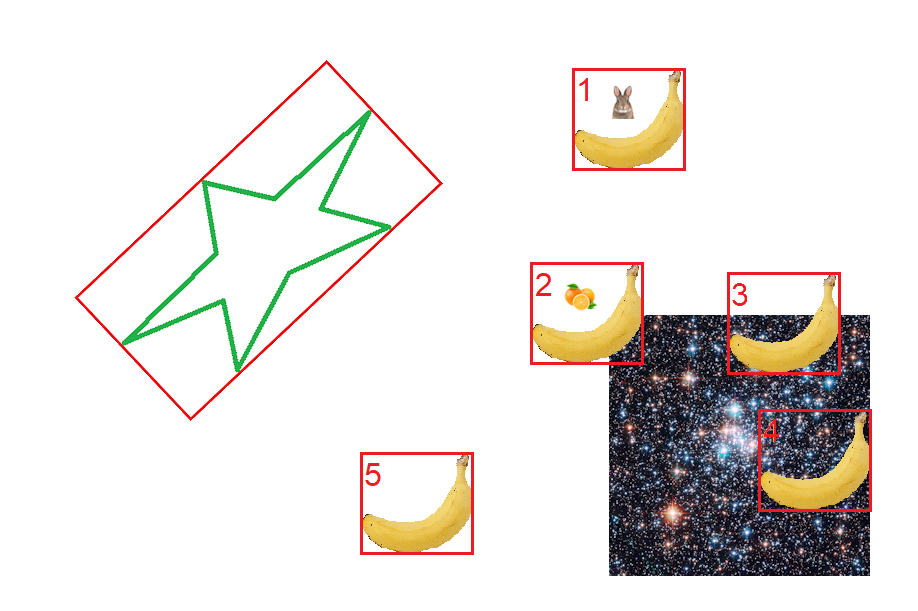
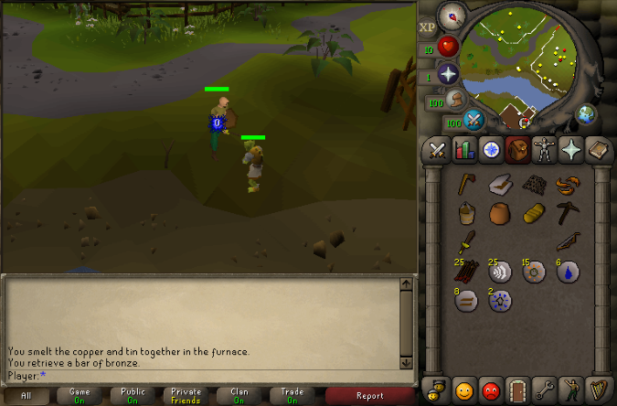

# digital-robot
A multi-threaded digital robot built in Python, with OpenCV for vision capabilities, that controls the mouse and keyboard to complete tasks. Created as a way of engaging with robotics problems, without hardware and additional physical world complications, by working to solve a digital world.

